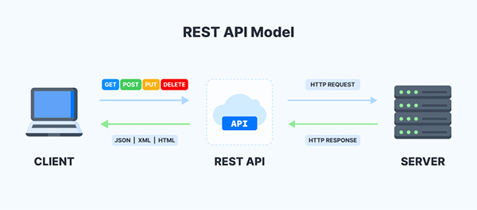

# Flask Ret API

## (00:00) Intro

## (00:12) Welcome

## (00:38) Tutorial Prerequisites

## (00:53) What is REST? What is an API?

(<https://developer.mozilla.org/en-US/docs/Glossary/REST>)

(<https://developer.mozilla.org/en-US/docs/Glossary/API>)

## (03:07) REST API Diagram



## (04:27) Virtual Environment set up

DONE

## (07:19) Install Dependencies

```py
pip3 install Flask flask_restful flask_sqlalchemy
```

`requirements.txt`

```text
aniso8601==9.0.1
blinker==1.8.2
click==8.1.7
Flask==3.0.3
Flask-RESTful==0.3.10
Flask-SQLAlchemy==3.1.1
greenlet==3.0.3
itsdangerous==2.2.0
Jinja2==3.1.4
MarkupSafe==2.1.5
pytz==2024.1
six==1.16.0
SQLAlchemy==2.0.31
typing_extensions==4.12.2
Werkzeug==3.0.3
```

`.gitignore`

```text

# Ignore virtual environment
.venv/

# Ignore Python bytecode
__pycache__/

# Ignore environment variables
.env

# Ignore PyCharm project files
.idea/

# Ignore compiled Python files
*.pyc

# Ignore distribution/build files
dist/
build/

# Ignore generated HTML files
# *.html

# Ignore log files
*.log

# Ignore OS-specific files
.DS_Store
Thumbs.db
```

## (09:56) A Simple REST API

```py
# api.py

from flask import Flask


app = Flask(__name__)


@app.route('/')
def home():
    return '<h1>Flask Rest API</h1>'


if __name__ == '__main__':
    app.run(debug=True) # development ONLY !
```

## (12:38) Modeling Data & Creating the Database

```py
# api.py

from flask import Flask
from flask_sqlalchemy import SQLAlchemy

app = Flask(__name__)

app.config['SQLALCHEMY_DATABASE_URI'] = 'sqlite:///database.db'
db = SQLAlchemy(app)


class UserModel(db.Model):
    id = db.Column(db.Integer, primary_key=True)
    name = db.Column(db.String(80), unique=True, nullable=False)
    email = db.Column(db.String(80), unique=True, nullable=False)

    def __repr__(self):
        return f'User(name = {self.name}, email = {self.email})'


@app.route('/')
def home():
    return '<h1>Flask Rest API</h1>'


if __name__ == '__main__':
    app.run(debug=True)
```

```py
# create_db.py
from api import app, db


with app.app_context():
    db.create_all()
```

run the following command to create the database:

```bash
python3 create_db.py
```

##   (17:19) Flask Restful

```py
from flask import Flask
from flask_sqlalchemy import SQLAlchemy
from flask_restful import Resource, Api, reqparse, fields, marshal_with, abort

app = Flask(__name__)

app.config['SQLALCHEMY_DATABASE_URI'] = 'sqlite:///database.db'
db = SQLAlchemy(app)
api = Api(app)


class UserModel(db.Model):
    id = db.Column(db.Integer, primary_key=True)
    name = db.Column(db.String(80), unique=True, nullable=False)
    email = db.Column(db.String(80), unique=True, nullable=False)

    def __repr__(self):
        return f'User(name = {self.name}, email = {self.email})'


@app.route('/')
def home():
    return '<h1>Flask Rest API</h1>'


if __name__ == '__main__':
    app.run(debug=True)

```

##   (18:26) Define args with RequestParser

```py
from flask import Flask
from flask_sqlalchemy import SQLAlchemy
from flask_restful import Resource, Api, reqparse, fields, marshal_with, abort

app = Flask(__name__)

app.config['SQLALCHEMY_DATABASE_URI'] = 'sqlite:///database.db'
db = SQLAlchemy(app)
api = Api(app)


class UserModel(db.Model):
    id = db.Column(db.Integer, primary_key=True)
    name = db.Column(db.String(80), unique=True, nullable=False)
    email = db.Column(db.String(80), unique=True, nullable=False)

    def __repr__(self):
        return f'User(name = {self.name}, email = {self.email})'


user_args = reqparse.RequestParser()
user_args.add_argument('name', type=str, required=True,
                       help='Name cannot be blank')
user_args.add_argument('email', type=str, required=True,
                       help='Email cannot be blank')


@app.route('/')
def home():
    return '<h1>Flask Rest API</h1>'


if __name__ == '__main__':
    app.run(debug=True)

```

##   (19:51) /api/users Resource Endpoint

```py
# api.py
from flask import Flask
from flask_sqlalchemy import SQLAlchemy
from flask_restful import Resource, Api, reqparse, fields, marshal_with, abort

app = Flask(__name__)

app.config['SQLALCHEMY_DATABASE_URI'] = 'sqlite:///database.db'
db = SQLAlchemy(app)
api = Api(app)


class UserModel(db.Model):
    id = db.Column(db.Integer, primary_key=True)
    name = db.Column(db.String(80), unique=True, nullable=False)
    email = db.Column(db.String(80), unique=True, nullable=False)

    def __repr__(self):
        return f'User(name = {self.name}, email = {self.email})'


user_args = reqparse.RequestParser()
user_args.add_argument('name', type=str, required=True,
                       help='Name cannot be blank')
user_args.add_argument('email', type=str, required=True,
                       help='Email cannot be blank')


class Users(Resource):
    def get(self):
        users = UserModel.query.all()
        return users


api.add_resource(Users, '/api/users/')


@app.route('/')
def home():
    return '<h1>Flask Rest API</h1>'


if __name__ == '__main__':
    app.run(debug=True)

```

##   (21:54) Marshalling / Serializable JSON Data

```py
from flask import Flask
from flask_sqlalchemy import SQLAlchemy
from flask_restful import Resource, Api, reqparse, fields, marshal_with, abort

app = Flask(__name__)

app.config['SQLALCHEMY_DATABASE_URI'] = 'sqlite:///database.db'
db = SQLAlchemy(app)
api = Api(app)


class UserModel(db.Model):
    id = db.Column(db.Integer, primary_key=True)
    name = db.Column(db.String(80), unique=True, nullable=False)
    email = db.Column(db.String(80), unique=True, nullable=False)

    def __repr__(self):
        return f'User(name = {self.name}, email = {self.email})'


user_args = reqparse.RequestParser()
user_args.add_argument('name', type=str, required=True,
                       help='Name cannot be blank')
user_args.add_argument('email', type=str, required=True,
                       help='Email cannot be blank')


userFields = {
    'id': fields.Integer,
    'name': fields.String,
    'email': fields.String,
}


class Users(Resource):
    @marshal_with(userFields)
    def get(self):
        users = UserModel.query.all()
        return users


api.add_resource(Users, '/api/users/')


@app.route('/')
def home():
    return '<h1>Flask Rest API</h1>'


if __name__ == '__main__':
    app.run(debug=True)

```

##   (24:00) POST Data

- update the User class as follow:

```py
class Users(Resource):
@marshal_with(userFields)
def get(self):
    users = UserModel.query.all()
    return users

@marshal_with(userFields)
def post(self):
    args = user_args.parse_args()
    user = UserModel(name=args['name'], email=args['email'])
    db.session.add(user)
    db.session.commit()
    users = UserModel.query.all()
    return users, 201
```

- using Thunder Client or equivalent
- create a request `POST http://127.0.0.1:5000/api/users/` with following json data
  
```json
{
  "name": "John Doe",
  "email": "john_doe@email.com"
}

{
  "name": "Ervin Loretnz",
  "email": "ervin@lorentz.com"
}

{

  "name": "Mike Tyson",
  "email": "mike@tyson.com"
}
```

- also test for bad data, etc....

```json
{
  "name": "",
  "email": "ervin@lorentz.com"
}

{
  "name": "Mike Tyson"
}
```

##   (30:17) /api/users/id Resource Endpoint

- update the `api.py` as follow:

```py
# New!
class User(Resource):
    @marshal_with(userFields)
    def get(self, id):
        user = UserModel.query.filter_by(id=id).first()
        if not user:
            abort(404, message="User not found")
        return user


api.add_resource(Users, '/api/users/')
api.add_resource(User, '/api/users/<int:id>') # New!
```

- check ofr valid id, invalid id, valid but not existing user

##   (33:22) Update & Delete Data

- update the `User` class as follow:
  
```py
class User(Resource):
    @marshal_with(userFields)
    def get(self, id):
        user = UserModel.query.filter_by(id=id).first()
        if not user:
            abort(404, message="User not found")
        return user

    @marshal_with(userFields)
    def patch(self, id):
        user = UserModel.query.filter_by(id=id).first()
        if not user:
            abort(404, message="User not found")
        args = user_args.parse_args()
        user.name = args['name']
        user.email = args['email']
        db.session.commit()
        return user

    @marshal_with(userFields)
    def delete(self, id):
        user = UserModel.query.filter_by(id=id).first()
        if not user:
            abort(404, message="User not found")
        db.session.delete(user)
        db.session.commit()
        users = UserModel.query.all()
        return users, 200
```

- then run test using Thunder client to confirm code logic effectiveness
